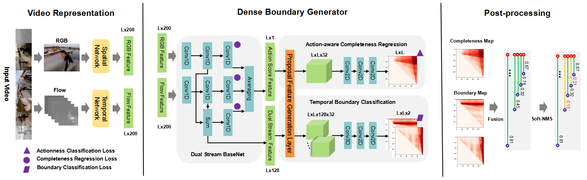

## [DBG-dense-boundary-generator](https://arxiv.org/pdf/1911.04127.pdf)

[](LICENSE)

By Chuming Lin*, [Jian Li*](https://lijiannuist.github.io/), [Yabiao Wang](https://github.com/ChaunceyWang), [Ying Tai](https://tyshiwo.github.io/), Donghao Luo, Zhipeng Cui, Chengjie Wang, Jilin Li, Feiyue Huang.

*indicates equal contributions

## Update

* 2019.11.12: Release tensorflow-version DBG inference code.
* 2019.11.11: DBG is accepted by AAAI2020.
* 2019.11.08: Our ensemble DBG ranks No.1 on [ActivityNet](http://activity-net.org/challenges/2019/evaluation.html) 

## Introduction
In this repo, we propose a novel and unified action detection framework, named DBG, with superior performance over the state-of-the-art action detectors [BSN](https://arxiv.org/abs/1806.02964) and [BMN](https://arxiv.org/abs/1907.09702). You can use the code to evaluate our DBG for action proposal generation or action detection. For more details, please refer to our paper [Fast Learning of Temporal Action Proposal via Dense Boundary Generator](https://arxiv.org/pdf/1911.04127.pdf)!

## Contents

* [Paper Introduction](#paper-introduction)
* [Prerequisites](#prerequisites)
* [Getting Started](#getting-started)
* [Citation](#citation)
* [Concat](#contact)

## Paper Introduction

 

This paper introduces a novel and unified temporal action proposal generator named Dense Boundary Generator (DBG). In this work, we propose dual stream BaseNet to generate two different level and more discriminative features. We then adopt a temporal boundary classification module to predict precise temporal boundaries, and an action-aware completeness regression module to provide reliable action completeness confidence.

### ActivityNet1.3 Results
<p align='center'>
 
</p>

### THUMOS14 Results
<p align='center'>
 
</p>

### Qualitative Results
<p align='center'>
  
</p>

## Prerequisites

- Tensorflow == 1.9
- Python == 3.6
- NVIDIA GPU == Tesla P40 
- Linux CUDA CuDNN

## Getting Started

### Installation

Clone the github repository. We will call the cloned directory as `$DBG_ROOT`.
```bash
git clone https://github.com/TencentYoutuResearch/ActionDetection-DBG.git
cd ActionDetection-DBG
export CUDA_VISIBLE_DEVICES=0
```

### Download Datasets

Prepare ActivityNet 1.3 dataset. You can use [official ActivityNet downloader](https://github.com/activitynet/ActivityNet/tree/master/Crawler) to download videos from the YouTube. Some videos have been deleted from YouTube，and you can also ask for the whole dataset by email.

Extract visual feature, we adopt TSN model pretrained on the training set of ActivityNet, Please refer this repo [TSN-yjxiong](https://github.com/yjxiong/temporal-segment-networks) to extract frames and optical flow and refer this repo [anet2016-cuhk](https://github.com/yjxiong/anet2016-cuhk) to find pretrained TSN model.

For convenience of training and testing, we rescale the feature length of all videos to same length 100, and we provide the 19994 rescaled feature at here [Google Cloud](https://drive.google.com/file/d/1MYzegWXgfZd-DD9gi_GPyZ_YAN5idiFV/view?usp=sharing) or [微云](https://share.weiyun.com/5FD85UY).

### Runing of DBG

You can download our [pretrained model](https://drive.google.com/file/d/178bWI_NsijkE5d-9lMXyt9Yk1rS9kuEG/view?usp=sharing) for evaluation. Set parameters on `config.yaml` and use a script to run DBG

```
bash auto_run.sh
```

This script contains:
#### 1. Training
```
python train.py ./config.yaml
```
#### 2. Testing
```
python test.py ./config.yaml
```
#### 3. Evaluating
```
python post_processing.py output/result output/result_proposal.json
```


## Citation
If you find DBG useful in your research, please consider citing: 
```
@inproceedings{DBG2020arXiv,
  author    = {Chuming Lin*, Jian Li*, Yabiao Wang, Ying Tai, Donghao Luo, Zhipeng Cui, Chengjie Wang, Jilin Li, Feiyue Huang},
  title     = {Fast Learning of Temporal Action Proposal via Dense Boundary Generator},
  booktitle   = {AAAI Conference on Artificial Intelligence},
  year      = {2020},
}
```

## Contact
For any question, please file an issue or contact
```
Jian Li: swordli@tencent.com
```
